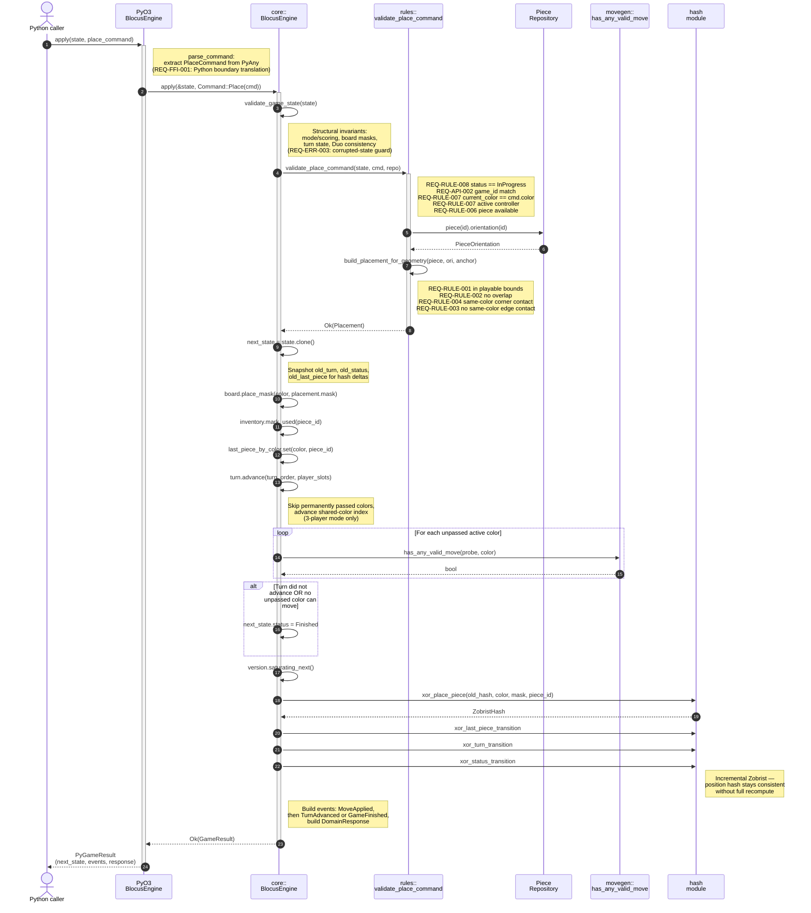
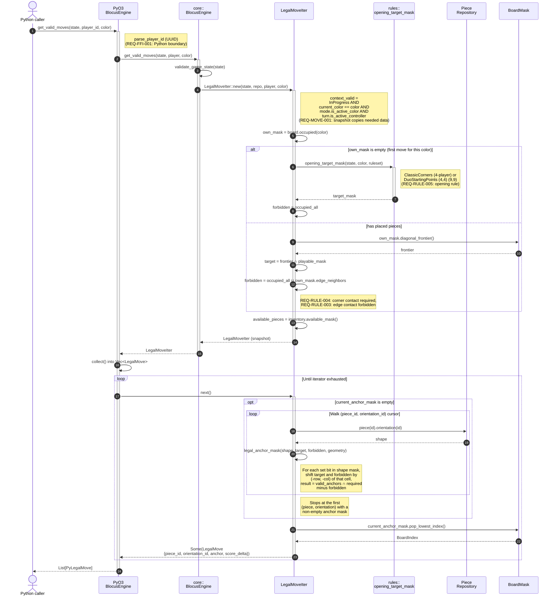

```mermaid
sequenceDiagram
    autonumber
    actor Py as Python caller
    participant PyEng as PyO3<br/>BlocusEngine
    participant Engine as core::<br/>BlocusEngine
    participant Rules as rules::<br/>validate_place_command
    participant Repo as Piece<br/>Repository
    participant MoveGen as movegen::<br/>has_any_valid_move
    participant Hash as hash<br/>module

    Py->>+PyEng: apply(state, place_command)
    Note right of PyEng: parse_command:<br/>extract PlaceCommand from PyAny<br/>(REQ-FFI-001: Python boundary translation)
    PyEng->>+Engine: apply(&state, Command::Place(cmd))

    Engine->>Engine: validate_game_state(state)
    Note right of Engine: Structural invariants:<br/>mode/scoring, board masks,<br/>turn state, Duo consistency<br/>(REQ-ERR-003: corrupted-state guard)

    Engine->>+Rules: validate_place_command(state, cmd, repo)
    Note right of Rules: REQ-RULE-008 status == InProgress<br/>REQ-API-002 game_id match<br/>REQ-RULE-007 current_color == cmd.color<br/>REQ-RULE-007 active controller<br/>REQ-RULE-006 piece available
    Rules->>Repo: piece(id).orientation(id)
    Repo-->>Rules: PieceOrientation
    Rules->>Rules: build_placement_for_geometry(piece, ori, anchor)
    Note right of Rules: REQ-RULE-001 in playable bounds<br/>REQ-RULE-002 no overlap<br/>REQ-RULE-004 same-color corner contact<br/>REQ-RULE-003 no same-color edge contact
    Rules-->>-Engine: Ok(Placement)

    Engine->>Engine: next_state = state.clone()
    Note right of Engine: Snapshot old_turn, old_status,<br/>old_last_piece for hash deltas
    Engine->>Engine: board.place_mask(color, placement.mask)
    Engine->>Engine: inventory.mark_used(piece_id)
    Engine->>Engine: last_piece_by_color.set(color, piece_id)
    Engine->>Engine: turn.advance(turn_order, player_slots)
    Note right of Engine: Skip permanently passed colors,<br/>advance shared-color index<br/>(3-player mode only)

    loop For each unpassed active color
        Engine->>MoveGen: has_any_valid_move(probe, color)
        MoveGen-->>Engine: bool
    end

    alt Turn did not advance OR no unpassed color can move
        Engine->>Engine: next_state.status = Finished
    end
    Engine->>Engine: version.saturating_next()

    Engine->>Hash: xor_place_piece(old_hash, color, mask, piece_id)
    Hash-->>Engine: ZobristHash
    Engine->>Hash: xor_last_piece_transition
    Engine->>Hash: xor_turn_transition
    Engine->>Hash: xor_status_transition
    Note right of Hash: Incremental Zobrist —<br/>position hash stays consistent<br/>without full recompute

    Note right of Engine: Build events: MoveApplied,<br/>then TurnAdvanced or GameFinished,<br/>build DomainResponse
    Engine-->>-PyEng: Ok(GameResult)
    PyEng-->>-Py: PyGameResult<br/>(next_state, events, response)
```

## Second: 

```mermaid
sequenceDiagram
    autonumber
    actor Py as Python caller
    participant PyEng as PyO3<br/>BlocusEngine
    participant Engine as core::<br/>BlocusEngine
    participant Iter as LegalMoveIter
    participant Rules as rules::<br/>opening_target_mask
    participant Repo as Piece<br/>Repository
    participant Mask as BoardMask

    Py->>+PyEng: get_valid_moves(state, player_id, color)
    Note right of PyEng: parse_player_id (UUID)<br/>(REQ-FFI-001: Python boundary)
    PyEng->>+Engine: get_valid_moves(state, player, color)

    Engine->>Engine: validate_game_state(state)
    Engine->>+Iter: LegalMoveIter::new(state, repo, player, color)
    Note right of Iter: context_valid =<br/>InProgress AND<br/>current_color == color AND<br/>mode.is_active_color AND<br/>turn.is_active_controller<br/>(REQ-MOVE-001: snapshot copies needed data)

    Iter->>Iter: own_mask = board.occupied(color)

    alt own_mask is empty (first move for this color)
        Iter->>+Rules: opening_target_mask(state, color, ruleset)
        Note right of Rules: ClassicCorners (4-player) or<br/>DuoStartingPoints (4,4) (9,9)<br/>(REQ-RULE-005: opening rule)
        Rules-->>-Iter: target_mask
        Iter->>Iter: forbidden = occupied_all
    else has placed pieces
        Iter->>Mask: own_mask.diagonal_frontier()
        Mask-->>Iter: frontier
        Iter->>Iter: target = frontier ∩ playable_mask
        Iter->>Iter: forbidden = occupied_all ∪ own_mask.edge_neighbors
        Note right of Iter: REQ-RULE-004: corner contact required,<br/>REQ-RULE-003: edge contact forbidden
    end

    Iter->>Iter: available_pieces = inventory.available_mask()
    Iter-->>-Engine: LegalMoveIter (snapshot)
    Engine-->>-PyEng: LegalMoveIter
    PyEng->>PyEng: collect() into Vec<LegalMove>

    loop Until iterator exhausted
        PyEng->>+Iter: next()

        opt current_anchor_mask is empty
            loop Walk (piece_id, orientation_id) cursor
                Iter->>Repo: piece(id).orientation(id)
                Repo-->>Iter: shape
                Iter->>Iter: legal_anchor_mask(shape, target, forbidden, geometry)
                Note right of Iter: For each set bit in shape mask,<br/>shift target and forbidden by<br/>(-row, -col) of that cell,<br/>result = valid_anchors ∩ required<br/>minus forbidden
            end
            Note right of Iter: Stops at the first<br/>(piece, orientation) with a<br/>non-empty anchor mask
        end

        Iter->>Mask: current_anchor_mask.pop_lowest_index()
        Mask-->>Iter: BoardIndex
        Iter-->>-PyEng: Some(LegalMove<br/>{piece_id, orientation_id, anchor, score_delta})
    end

    PyEng-->>-Py: List[PyLegalMove]
```