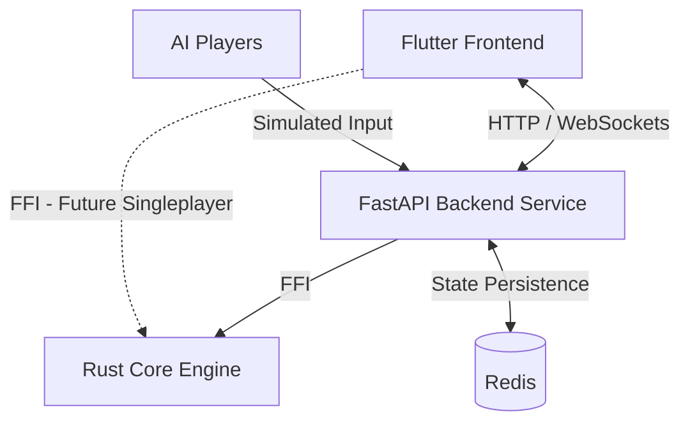

# Team_Summary.md

> **Team Project Summary**  
> *1-2 page overview of your team's project, AI usage, and key results.*

---

## Team Information

**Team Name:** `Design`  
**Project:** Blokus Game Engine (Classic + Duo)  
**Team Members:** Aleksander Kasak, Stephan Herbert, Tobias Friedrich

---

## Project Scope & Architecture

### Overview

The project implements a full-stack Blokus Game Engine encompassing both Classic and Duo variants. The tech stack focuses on a **Rust** core engine for game logic and move validation, integrated via FFI into a **Python (FastAPI)** backend service. The backend architecture is cloud-native, orchestrating multiplayer connections via HTTP/WebSockets and utilizing **Redis** for robust state management. Players interact through a **Flutter** frontend that supports seamless multi-platform gameplay (iOS/Android/Web/Desktop).

### Architecture Diagram

### Key Components

1. **Rust Core Engine:** Handles core rules, board dimensions, legal placement evaluations, turn tracking, and scoring calculations.
2. **Backend Service Layer:** Manages request endpoints, WebSocket connections, concurrency, and interfaces directly with the Rust engine.
3. **State Management:** Redis instance used specifically for horizontal scalability and managing active lobby/game states efficiently in the cloud.
4. **AI Players:** Embedded simulation logics allowing automated agents to participate inside the backend loops.
5. **Flutter Frontend:** Provides the interactive user interface, rendering lobbies, and facilitating real-time drag-and-drop gameplay syncing with the backend.

---

## AI Tools Used

### High-Level Overview

Describe which AI tools you used and where. Be specific about the tools/models and how they were integrated into your workflow.

| Phase                          | AI Tool/Model                                    | Usage                                                   | Validation Method                                   |
|--------------------------------|--------------------------------------------------|---------------------------------------------------------|-----------------------------------------------------|
| Requirements                   | GPT 5.5, GPT 5.4, Gemini 3.1 Pro                 | Requirements extraction and specification building      | Manual verification, LLM as a judge                 |
| Design                         | Gemini 3.1 Pro, GPT 5.5                          | LLM ADR generation                                      | Manual review                                       |
| Code Gen & Testing & Debugging | Codex, Claude Code, GitHub Copilot, GPT 5.5 Chat | FFI bindings, core logic, Flutter UI, and test suites   | Manual code execution, test suites, LLM code review |
| Code Review                    | GPT 5.5                                          | Automated pull request PR feedback and structure checks | Manual verification                                 |

### AI Usage Policy

Describe any AI usage policies, guidelines, or constraints your team followed during development. This may also include course-specific requirements, or internal team agreements.

| Policy/Guideline        | Description                                                                                 | Application                                                                                                |
|-------------------------|---------------------------------------------------------------------------------------------|------------------------------------------------------------------------------------------------------------|
| Privacy & Data Security | No proprietary data; do not feed personal bound information into models.                    | Prevented usage of live user data or sensitive material into prompts.                                      |
| Latest Tool Usage       | Guarantee use of the latest LLM Models (Gemini 3.1 Pro, GPT 5.5, Opus 4.7).                 | Ensured our outputs leveraged state-of-the-art capability for better logic results.                        |
| AI Generation Rule      | Do not code large parts yourself, optimize prompts to implement code in a shorter timespan. | Addressed the core course objective by evaluating LLMs' coding capabilities instead of manual keystroking. |

---

## Key Results

### What Worked Well

- `[Result 1]`
- `[Result 2]`
- `[Result 3]`

### What Failed or Was Challenging

- `[Challenge 1]`
- `[Challenge 2]`
- `[Challenge 3]`

### Lessons Learned

- `[Lesson 1]`
- `[Lesson 2]`
- `[Lesson 3]`

---

## Top 3 Counterexamples

Provide links to notable counterexamples where guidelines from other teams did not work as expected.

1. **Counterexample 1:** `[Title]`  
   **Link:** `[Link to counterexample documentation]`  
   **Guideline that Failed:** `[Name of guideline]`  
   **What Happened:** `[Brief description]`

2. **Counterexample 2:** `[Title]`  
   **Link:** `[Link to counterexample documentation]`  
   **Guideline that Failed:** `[Name of guideline]`  
   **What Happened:** `[Brief description]`

3. **Counterexample 3:** `[Title]`  
   **Link:** `[Link to counterexample documentation]`  
   **Guideline that Failed:** `[Name of guideline]`  
   **What Happened:** `[Brief description]`

> **Note:** The link to counterexample documentation can be any repository path or platform link (e.g., issue)

---

## Classic → Duo Change Request

### Impact on Design

How did the requirement to support Blokus Duo affect your design decisions?

- **Initial Design Decisions:** `[Description]`
- **Changes Made for Duo Support:** `[Description]`
- **Challenges Encountered:** `[Description]`
- **Solutions Implemented:** `[Description]`

### Configuration Approach

How did you implement configuration to support both Classic and Duo modes?

- `[Description of configuration approach]`

### Testing Strategy

How did you update your test suite to cover both modes?

- `[Description of testing strategy]`

---

## Repository Links

- **Project Repository:** `[Link to repository]`
- **Issue Tracker:** `[Link to issues]`
- **CI/CD Pipeline:** `[Link to CI/CD, if used]`

---

## Instructions for Use

1. **Replace all `[...]` placeholders** with your team's specific content
2. **Keep it concise** (1-2 pages max)
3. **Include one architecture diagram** (can be simple ASCII art or an image)
4. **Be honest about what worked and what didn't**
5. **Link to specific counterexamples** and documentation
6. **Reflect on how the change request affected your design**
7. **Submit as `Team_Summary.md`** in your project repository

---

*Template version: 1.0 | Last updated: 24 February 2026*
